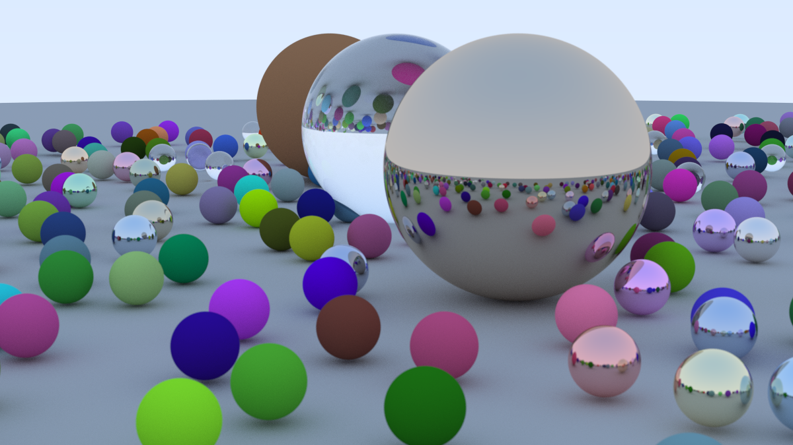

# Ray Tracing in One Weekend - Rust Implementation

这是一个使用 Rust 语言实现的简单光线追踪器。本项目是跟随 Peter Shirley 的经典教程 [_Ray Tracing in One Weekend_](https://raytracing.github.io/books/RayTracingInOneWeekend.html) 逐步构建完成的。

## 🖼️ 最终渲染结果

这是本项目渲染出的最终场景（Final Scene），包含了漫反射、金属和电介质（玻璃）材质的球体，以及景深（Defocus Blur）效果。



*(原图也提供了 PPM 格式，位于 `assets/image.ppm`)*

## ✨ 功能特性

本项目实现了路径追踪（Path Tracing）的核心功能：

* **基础几何体**：球体（Sphere）及其碰撞检测。
* **材质系统**：
    * **Lambertian**：理想的漫反射材质（Matte）。
    * **Metal**：金属材质，支持通过 Fuzz 参数调节表面粗糙度。
    * **Dielectric**：电介质材质（如玻璃、水），支持折射和全内反射（Schlick 近似）。
* **相机系统**：
    * 可调节视场角（FOV）。
    * **景深（Depth of Field）**：支持光圈（Defocus Angle）和焦距（Focus Distance）调节，模拟真实相机的散焦模糊。
* **抗锯齿（Anti-aliasing）**：通过多重采样（MSAA）平滑边缘。
* **Gamma 校正**：确保颜色在显示器上正确显示。

## 🚀 快速开始

### 前置要求

* 安装 [Rust](https://www.rust-lang.org/) 环境 (Cargo)。

### 运行项目

光线追踪是计算密集型任务，**强烈建议**使用 `--release` 模式运行，否则渲染速度会非常慢。

1.  **克隆仓库**

    ```bash
    git clone <YOUR_REPO_URL>
    cd <YOUR_REPO_DIRECTORY>
    ```

2.  **构建并运行**

    程序默认将 PPM 格式的图片数据输出到标准输出（stdout）。你可以将其重定向到一个 `.ppm` 文件中。

    ```bash
    # 使用 Release 模式运行并将输出保存为 image.ppm
    cargo run --release > image.ppm
    ```

    *注：渲染最终场景（高分辨率、高采样率）可能需要几分钟到几十分钟的时间，具体取决于你的 CPU 性能。*

3.  **查看结果**

    生成的 `image.ppm` 可以使用支持 PPM 格式的查看器打开，或者使用在线工具转换为 PNG/JPG。

## 📚 参考资料

本项目的所有理论基础和算法逻辑均来自以下教程：

* [_Ray Tracing in One Weekend_](https://raytracing.github.io/books/RayTracingInOneWeekend.html) by Peter Shirley, Trevor David Black, and Steve Hollasch.

## 📝 许可证

[MIT License](LICENSE)