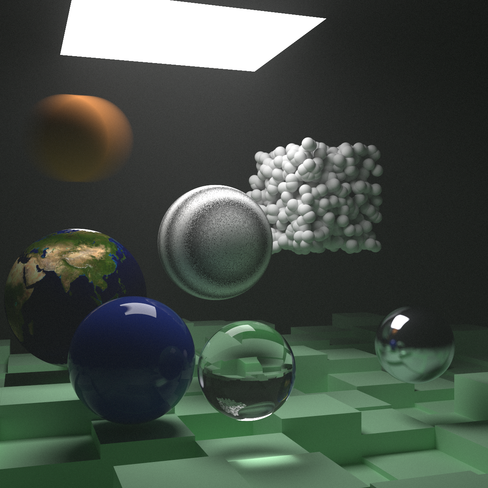

# Ray Tracing in One Weekend - Rust Implementation

[](https://www.rust-lang.org/)
[](LICENSE)

这是一个使用 **Rust** 语言实现的光线追踪器。本项目完整实现了 Peter Shirley 的经典光线追踪教程系列《Ray Tracing in One
Weekend》和《Ray Tracing: The Next Week》，并利用 Rust 的语言特性进行了工程化和性能优化。

## 🖼️ 最终渲染结果



## ✨ 已实现特性 (Features)

本项目不仅实现了基础的光线追踪功能，还包括了许多高级特性：

### 核心渲染

- **路线追踪**：完整实现了光线追踪的核心算法，包括递归计算反射、折射、阴影等。
- **多重采样抗锯齿（MSAA）**：通过对每个像素进行多次随机采样，减少了 aliasing 现象，提升了图像质量。
- **Gamma 校正**：在输出图像前对颜色进行 gamma 校正，确保显示在屏幕上的颜色与预期一致。
- **BVH 加速支持**：利用层次包围盒（Bounding Volume Hierarchy）对场景中的物体进行加速，显著提高了渲染效率。

### 几何体与材质

- **几何体**：包括球体（Sphere）、四边形（Quad）、长方体（Box）。
- **变换**：包括平移（Translation）和沿 Y 轴旋转（RotateY）。
- **体积渲染**：支持恒定密度介质（Constant Medium）的体积渲染，烟雾、雾气等次表面散射效果。
- **材质系统**：
    - **Lambertian 材质**：基于反射率的材质模型，模拟漫反射表面。
    - **Metal 材质**：基于反射率和模糊度的材质模型，模拟金属表面。
    - **Dielectric 材质**：基于折射率的材质模型，模拟透明和折射表面。
    - **DiffuseLight 材质**：用于模拟环境光或光源的材质模型，每个点的颜色都是相同的。
    - **Isotropic 材质**：基于反射率的材质模型，模拟均匀分布的反射。

### 纹理与贴图

- **Solid Color 纹理**：纯色纹理。
- **Checker 纹理**：程序化棋盘格纹理（支持空间颜色过滤）。
- **Image 纹理**：支持加载外部图片 (JPG/PNG) 作为纹理映射 (UV Mapping)。
- **Noise 纹理**：基于 Perlin Noise 的程序化纹理 (支持大理石纹理生成)。

### 相机系统

- **位置可调**：支持 `look_from`, `look_at`, `vup` 自定义视角。
- **景深效果 (DoF)**：模拟真实相机的散焦模糊 (Defocus Blur)，支持光圈大小和焦距调节。
- **视场角 (FOV)**：垂直 FOV 可调。

## ⚙️ 命令行参数 (CLI Arguments)

```powershell
cargo run --release -- [OPTIONS]
```

本项目使用 `clap` 进行命令行参数解析，支持灵活的渲染参数配置而无需修改代码。
以下是所有可用的命令行选项：

### 🖥️ 渲染配置 (Render Config)

| 参数 (Long)             |  简写  | 描述              |        默认值        |
|:----------------------|:----:|:----------------|:-----------------:|
| `--image-width`       | `-w` | 输出图像的宽度 (像素)    |      `1200`       |
| `--aspect-ratio`      | `-a` | 图像宽高比           | `1.777...` (16:9) |
| `--samples-per-pixel` | `-s` | 每个像素的采样次数 (SPP) |       `500`       |
| `--max-depth`         | `-d` | 光线弹射的最大递归深度     |       `50`        |
| `--output-path`       | `-o` | 输出图片的文件路径       |    `image.ppm`    |

### 🎬 场景配置 (Scene Config)

| 参数 (Long)              |  简写  | 描述                                           |
|:-----------------------|:----:|:---------------------------------------------|
| `--scene`              |  -   | **选择要渲染的场景类型** (见下方列表)                       |
| `--image-texture-path` | `-t` | 指定外部纹理图片的路径 (仅 `earth` 或 `cornell-final` 需要) |

### 📋 可选场景列表 (`--scene`)

| 值 (Value)       | 描述                           | 对应教程章节       |
|:----------------|:-----------------------------|:-------------|
| `bouncing`      | **(默认)** 随机生成的弹跳小球场景         | Chapter 2    |
| `checkered`     | 棋盘格纹理场景                      | Chapter 3    |
| `earth`         | 地球纹理场景 (需配合 `-t` 参数)         | Chapter 4    |
| `perlin`        | 柏林噪声纹理场景                     | Chapter 5    |
| `quad`          | 四边形场景                        | Chapter 6    |
| `light`         | 简单光照场景                       | Chapter 7    |
| `cornell-box`   | 标准 Cornell Box 场景            | Chapter 7, 8 |
| `cornell-smoke` | 带烟雾/体积雾的 Cornell Box         | Chapter 9    |
| `cornell-final` | 最终测试场景 (The Next Week Final) | Chapter 10   |

**示例命令**：
渲染高质量的最终场景（1200x1200，10000 SPP，500 最大递归深度）:

```powershell
$env:RAYON_NUM_THREADS=8; cargo run --release -- --scene cornell-final --image-texture-path ./assets/earth.jpg --samples-per-pixel 10000 --max-depth 500             
```

> **⚠️ 高负载预警**：
> 上述配置属于极端质量设置。作为参考，在 **Intel Core Ultra 7 255H (共 16 核心，使用 8 线程)** 处理器上，该渲染任务需要 **数小时**
> 才能完成。请做好长时间运行的心理准备，并确保设备散热良好。

## 🚀 并发控制与性能 (Concurrency & Performance)

本项目利用 Rust 强大的数据并行库 **[Rayon](https://github.com/rayon-rs/rayon)** 实现了高效的多线程渲染。

### 核心机制

* **工作窃取 (Work-stealing)**：渲染器会自动创建一个线程池（默认大小等于 CPU
  逻辑核心数）。当某个线程完成了分配给它的扫描线任务后，它会自动从其他繁忙线程的队列中“窃取”任务。
* **负载均衡**：这确保了即使某些区域（如复杂的玻璃折射）计算量巨大，CPU 的所有核心也能始终保持满载，不会出现“一核有难，多核围观”的情况。

### 限制并发 (防止系统卡顿)

**默认行为**：程序会尝试占满所有可用的 CPU 算力（100% 占用）。

如果你在渲染的同时需要使用电脑进行其他工作（如浏览网页、写代码），建议通过设置环境变量 `RAYON_NUM_THREADS` 来限制使用的线程数（例如保留
2-4 个核心给系统）。

**不同操作系统的设置方法：**

#### Linux / macOS (Bash/Zsh)

```bash
# 限制为 4 个线程运行
RAYON_NUM_THREADS=4 cargo run --release -- -o image.ppm
```

#### Windows (PowerShell)

```powershell
# 限制为 4 个线程运行
$env:RAYON_NUM_THREADS=4; cargo run --release -- -o image.ppm
```

#### Windows (CMD)

```cmd
:: 设置环境变量并运行
set RAYON_NUM_THREADS=4 && cargo run --release -- -o image.ppm
```

## 📚 参考资料

本项目的所有理论基础和算法逻辑均来自以下教程：

* [_Ray Tracing in One Weekend_](https://raytracing.github.io/books/RayTracingInOneWeekend.html)
* [_Ray Tracing: The Next Week_](https://raytracing.github.io/books/RayTracingTheNextWeek.html)

## 📝 许可证

[MIT License](LICENSE)